# compile5numbers
This script was created to compile Tukey Five-Number Summaries to be used in the context of Cestode taxonomic descriptions.

## Justification: Cestode Taxonomy and Statistics

As show above, like other tools available out there, WormBox compute summary statistics from your images. This summary includes measures of central tendencies and dispersion of your data, as well as averages of pseudoreplicated data. All these concepects will be discussed below. If you gathered morphometric data and summarized the information using statistics you have to think what those values mean to you – truelly what can you do with them. Are they simply a description of your data? or Are they sample statistics from which you are trying to estimate parameters of population? These are two fundamentally different approaches in statistics pertaining to descriptive and inferential statitistics – respectively. This dichotomy may, at first glance, be trivial and uninteresting, but for statistical theory they are not! If you put these questions into the context of taxonomic descriptions, and you state:

_<div align="center">"Mature proglottids 10–17 (12±3; 6) in number, 728–1,892 (1,153±228; 47) long by 291–586 (460±70; 47) wide, .."</div>_

You should then consider whether these statistical statements only describe your data (i.e., the morphometric attributes of a type series, for instance) or they were calculated with the intent of estimate values of all individuals that belong to the taxon you just described – therefore, potentially diagnostic characters. If you consider them to be descriptive statistics, these numbers only describe the distribution of what is shown before us and, as such, cannot be used to draw any specific conclusions based on any hypothesis or test (Klazema, 2014). On the other hand, if they were meant to be used as an inferential statistics tool, these numbers must come from one or more representative samples from the set you are interested and subsequently be used to test statistical hypotheses.
This rational has serious implications on the use of morphometric data as diagnostic characters. If the statistics you reported were summarized under the premise they were only descriptive, it would be inconsistent to use them as diagnostic characters. To be used as diagnostic characters, it is implicit that your samples allow valid estimation of population parameters that represent your taxon concept.
The present day taxonomic literature on cestodes (as in many other groups) are flooded with summary statistics. If you look historically, you will find a clear trend in which throughout the years new variables – structures measured and/or counted – have been added into descriptions; as if a well performed taxonomic description depended on larger numbers of assessed variables! On the other hand, little effort has been put into increasing sample sizes and/or in their statistical validity. Whether taxonomists working on these groups have ever reflected up on the distinction between descriptive and inferential nature of the data they present and how that would affect their practice is an open question. The available literature suggests that, as a community, we seem to loosely jump from one context to the other as we please without statistical rigor. In the sections below, we will illustrate the major problems we recognize on the use of statistics in taxonomy of cestodes and propose some guidelines which we consider more appropriate for the data we compile.

## The tradition and implications

It would be fair to start with an example in which one of us is involved so that we are not criticized for hiding our own mistakes while pointing the others. We should recognize that all of us are bound follow tradition without critical evaluation at some point. Few years ago, Marques et al. (2012) described a new taxon called Ahamulina catarina – a new genus and species of diphyllidean found in deep water catsharks off the coast of Brazil. Here is what they stated in part of the description of this new taxon based on on 9 complete and 6 incomplete whole-mounted specimens, cross-sections of 2 proglottids (Marques et al., 2012:55):

_<div align="center">"Mature proglottids 10–17 (12±3; 6) in number, 728–1,892 (1,153±228; 47) long by 291–586 (460±70; 47) wide, .."</div>_

- Menoret & Ivanov (2011:179) described a rhinebothriidean Rhinebothrium corbatai based on 9 complete mature specimens and 1 strobila without scolex and reported:

_<div align="center">"Testes oval, 3--5 (4±1, n=9, n=28) per proglottid, 20--57 (39±10, n=9, n=55) long, 10-47 (28±8, n=9, n=55) wide, ...";</div>_

- Scholz & de Chambrier (2012:652) described the proteocephalidean Pangasiocestus romani based on 5 specimens and submitted:

_<div align="center">"Cirrus sac widely pyriform, 140–200 long and 90–170 wide, its length representing only 14–21% of proglottis width (x = 17%, n = 26) ... Ovary width represents 72–79% (x = 76%, n = 25, CV = 3%) of proglottis width ...";</div>_

Schaeffner & Beveridge (2013:258) described the trypanorhinch Prochristianella mattisi based on 11 whole-mounts and two specimens in glycerol and reported:

_<div align="center">"..., prebulbar organs present, small; bulbs elongate (Fig. 3), bent, thick-walled, 600-760 (649 ± 53; n = 22) long by 100-130 (117 ± 10; n = 22) wide, ...";</div>_

- Dimitrova et al. (2013:217) described the dilepidinean Pseudangularia gonzalezi based on four complete specimens in addition to fragments of two additional specimens (6 slides) and described:

_<div align="center">"Distal part of atrium wide, 35–99 (52, n = 21) deep, with diameter 7–45 (24, n = 21) at orifice ...".</div>_


There are two components we are concerned and will discuss in detail below. One is related to the concept of pseudoreplication (sensu Hurlbert, 1984) – which seems to permeate this literature. The other concerns the implicit assumptiom of that the data have a normal or at least bell-shaped distribution. We will start with the problem of pseudoreplication, then we will revisit some of the properties of the parameters that describe statistical distributions, and finally, we will try to convince you that there are more informative metrics that we could adopt when describing our morphometric data.

### Pseudoreplication

One of the fundamental assumptions of most statistical techniques is that observations are independent of one another (Hurlbert 1984). Pseudoreplication typically occurs when the number of observations are treated inappropriately as independent replicates. Observations may not be independent if ( i ) repeated measurements are taken on the same subject, ( ii ) the data have a hierarchical structure, ( iii ) observations are correlated in time, or ( v ) observations are correlated in space (Millar and Anderson,2004; but see Schank and Koehnle, 2009). Pseudoreplication is not uncommon in other areas of research (Hurlbert 1984, Millar and Anderson,2004; Lazic, 2010; among others) and a lot of debate has been published in the literature since Hurlbert (1984) called the attention of ecologists to the problem. Since then, researchers either acknowledged the problem and tried to avoid it by redefining experimental or sampling design and/or relying on more complex statistical models or, sadly, simply noting its existence and then keep doing what was done before (see Schank and Koehnle, 2009; Zuur et al., 2010). We hope you do not choose the latter.

We should go back to the taxonomic examples above and compare the number of individuals (whole worms) available for each description and the sample size reported for each variable. It should be obvious that for some variables (i.e., structures or part of thereof), the descriptive statistics is based on a larger number of observations than the amount of individual worms available to the investigator. For instance, Marques et al. (2012) reported that the mature proglottid of Ahamulina catarina was 728–1,892 (1,153±228; 47) long by 291–586 (460±70; 47) wide, all based on 47 observations. How could that be if they had only ”9 complete and 6 incomplete whole-mounted specimens“? A hint: they took more than a single measurement from a single specimen. This is pseudoreplication.

It is true that most statistical techniques assume that observations are independent – but but we do not use at all those that account for dependency. One could suggest that maybe the examples above are not such a terrible sin after all. However, all statistical metrics we are using assume independence and, for inferencial purposes would also require special attention to sample sizes and random sampling. Thus, repeated measurements taken on the same subject violate one of the major assumption and statistic. We will provide you an example to illustrate how pervarsive can be the introduction pseudoreplication to the description of your data – just in case the violation did not convince you already that you should avoid it. Consider the data presented in Table 1.

<div align="center">Table 1. Theoretical example showing the effects of pseudoreplication on 15 random samples from a log-normal distribution.</div>

<p align="center">
  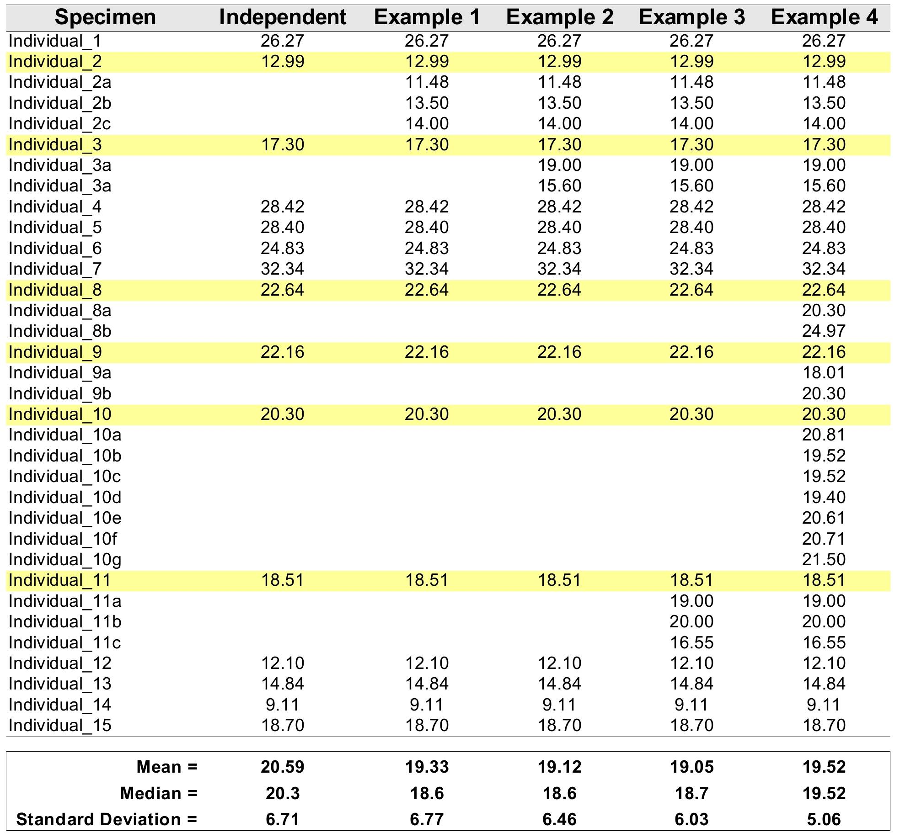
</p>

The table above starts 15 random numbers withdrawn from a log-normal distribution (meanlog = 3, sdlog = 0.35). The theoretical mean and median of the lognormal can be easily be calculated<sup>[1]</sup> and in this case are mean = 21.35423 and median = 20.08554. We will refer to these values as population parameters. Differences between mean and median indicate that the data deviate from symmetric distribution (e.g., normal, we will come back to that soon). When we calculated the mean and median from our sample (15 datapoints), we obtained the values of 20.56 and 20.30; respectively, which will refer as sample estimated parameters. Due to the finite sample size, we observe that the population parameters are not identical to those estimated from the sample. Additionally, the differences between central tendencies estimated from the sample are not as discrepant from each other when compared to those obtained for the population. Hence, based on the sample, the data seem not to deviate as much from a symmetric distribution as the population parameters would suggest.

In Table 1, the columns Examples 1–4 include incremental amounts of pseudoreplication for 6 randomly chosen individuals (highlighted in yellow). For each example, pseudoreplication was introduced so that the mean value of the original individual was maintained. For instance, for “individual_1” the original value was 12.99, and the mean for all introduced pseudoreplication (i.e., (12.99+11.48+13.50+14.00)/4 = 12.99) has the same value.

This example show some undesirable (not to say, statistically unsound practice) effects of pseudoreplication. It is noticeable that all parameter estimation for central tendencies and spread of the distribution (i.e., stardard deviation) dissociate from the original values of the sample and the population. Note that in Example 4, the mean and the median are identical, indicating that the data follow a symmetric distribution when in fact it was generated under a log-normal model. Finally, as the parameter that measure dispersion (or spread) of the data, standard deviation – although inappropriate for asymmetric distributions will be demonstrated latter –, tends to get smaller (i.e., reducing the spread, which is a measure of variability in the data) because repeated measurements from the same specimem will introduce less variability than adding measurements from additional specimens.

Thus, as a rule, pseudoreplication will (_i._) **introduce bias**, (_ii._) **reduce accuracy**, and (_iii._) **violate the basic premises of statistics**. All of which, we should avoid at all costs.

The take home message of this section is simple: if you desire to increment your sample size, do that by sampling data for more individuals – unless you are interested on intra-individual variation, but that is a different ball game and beyond the scope of this section. If you have pseudoreplicates in your dataset, the simplest way to correctly deal with them is to average them by individuals – along the same line that the application WormBox (above) deal with them.


### Distributions and summary statistics

Descriptive statistics help to describe and summarize data in a meaningful way such that, for example, patterns might emerge from the data. For instance, when Marques et al. (2012:55) stated that Ahamulina catarina is an apolytic worm 23–45 (30±7; 8) mm long, the notation presented the authors' summary the data compiled from 8 mature worms, from which they obtained the following data: 3.233, 25.237, 33.651, 27.342, 25.117, 44.779, 27.473, and 33.323 mm.

The notation “23–45 (30±7; 8)”, so common in our field (see examples above), is the results of univariate analyses that entail some assumptions about the property and nature of the data. By definition, univariate analysis involves the examination across cases of one variable at a time. The goal of this analysis is to provide some information on the distribution, central tendency and the spread (variability or dispersion) of the data, for those are the three major characteristics of a single variable.

** Distribution **

The distribution is a summary of the frequency of individual values or ranges of values for a variable. One of the most common ways to describe a single variable is with a frequency distribution (Trochim, 2006). In Figure 1A you will find the frequency distribution of the total length of Ahamulina catarina compiled by Marques et al. (2012). Another way of describing the distribution of this data would be by a histogram of the probability densities (Figure 1B). This is simply a rescaling of the y-axis to make the areas of the bars sum<sup>[2]</sup>. Under the density scale, the probability of sampling at random an observation that has between 30 and 35 mm is equal to the proportion of the summed area of the bars that encompasses this interval in the histogram. Finally, in Figure 1C we represent a theoretical Probability Density Function (PDF), assuming a normal distribution (i.e., the most popular bell-shaped, symmetric distribution) defined by two parameters estimated from the data, one which matches the theoretical central tendency and the other that matches the theoretical spread – which we will discuss in detail below. For density functions, the area below the curve defines the probability of withdrawing a random sample witing that area. Hence the total area under the curve is one, which is the same to say that a measure has a probability of 1.0 to assume one of the possible values in the range defined by the distribution.

<p align="center">
  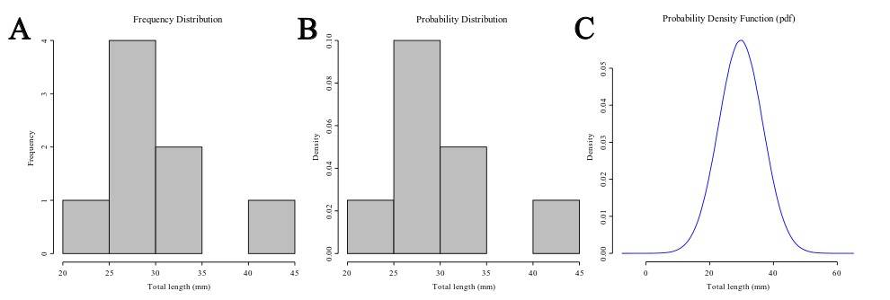
</p>

**Figure 1:** Distribution of 8 measurements of total length for Ahamulina catarina used in its original description. **A**. Frequency distribution of the data. **B**. Probability distribution of the data. **C**. Mathematical distribution or Probability density Function of a normal distribution model assuming estimated parameters from the data.


**Central Tendency**

The central tendency of a distribution is an estimate of the “center” of a distribution, and as such should give you an idea on what particular value or interval of values most of your samples reside. This is an useful metric, especially when you have no access to a graphic representation of the distribution. In fact, parameters such as central tendency, dispersion and skewness should try to do the best description of your distribution. According to Lane at al. (2014), there are three main ways of defining the center of a distribution, and the parameters used to inform us of the central tendency of a distribution rely on those different definitions. One possible way would be to consider de central tendency is the point at which the distribution is in balance. An alternative measure would be considering the center of a distribution the value that minimize that absolute deviations (differences). Finally, the concept of central tendency could be based on the value that minimizes the sum of squared deviations.

There are three major types of measures of central tendency: **Mean** (arithmetic), **Median** and **Mode**. The arithmetic mean is the most common measure of central tendency in our field. The theoretical mean is the sum of each in the range of the distribution times the probability the distribution assigns to it<sup>[3]</sup>, and is related to minimizing the sum of squares of deviations from the central tendency. The median is also a frequently used measure of central tendency – although in our field rarely so. The median, also referred as the 50th percentile as it halves the area of the distribution, is the midpoint of a distribution and is based on the concept of the sum of the absolute deviations. Finally, the mode is the most frequently occurring value.


<p align="center">
  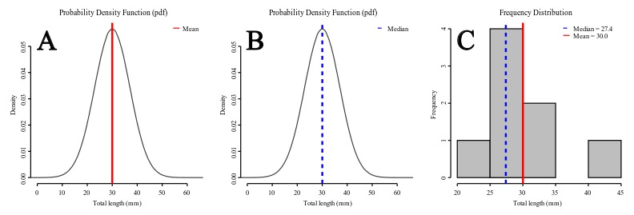
</p>

**Figure 2.** Central tendency for Ahamulina catarina based on the distribution of original data. **A.** Position of the mean on the normal density function. **B.** Position of the median on the normal density function. **C.** Position of the mean and median on the empirical frequency distribution.

Under a normal distribution model (see Figures 2A-B) mean and median are equal. However, as the distribution deviates from normality and becomes asymmetric (skewed, as data suggest in Figure 2C) the mean differs from the median. For instance, if the mean is larger than the median, that is a sign that your distribution has a positive skew – the tail on the right side of the distribution is longer or fatter than the left side one.

**Dispersion**

Dispersion refers to the spread of the values around the central tendency and indicates how spread out the data is. As for the central tendency, there are several measures of dispersal. In fact, we commonly use two of them as can be seen in the taxonomic examples we provided above. Recall that the notation “23–45 (30±7; 8)”, express the range (i.e., 23–45), the mean (i.e. 30), the standard deviation (i.e., 7), and the sample size (i.e., 8) for a given variable. Of those, **range** and **standard deviation** are two measures of dispersion. Below we explain some of their properties and present other measures of variability.

<p align="center">
  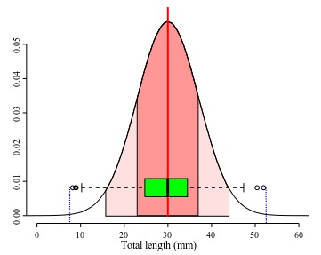
</p>

**Figure 3.** Estimated probability density function for normal distribution for total length of Ahamulina catarina based on parameters estimated from empirical data by Marques et al. (2012) showing different measures of dispersion. Boxplot is in green. Dark red area under the curve represent the area of 1 x standard deviation and lighter red area 2 x standard deviation. Red solid vertical line represents the mean. Vertical dashed blue lines indicate lower ad upper limits of the range from 1000 random numbers drawn from the distribution. The theoretical range of the normal can not be depicted because it is minus inifinity to infinity.

The **range** is one of the simplest measures of dispersion. In the sample it is obtained by subtracting the minimum score from the maximum score of your data. For instance, in Figure 3, the small circles in the plot represent values distributed at the beginning and at end of a sample of 1000 values. The vertical dashed blue lines in that plot indicate lower ad upper limits of the observed range. A practical shortcoming of the observed range is that it is very sensitive to extreme values or outliers (possible spurious observation, see below). Thus if you have an extreme value in your sample associated with error, it will spread spuriously the range of your variable. A more subtle shortcoming is that the observed ranges are very poor estimates of the true range for most distributions, because it is hard to estimate the true maximum and minimum values of a given measure. Usually, as we increase our sample there is always a probability to find a value that is larger than the largest already found (or smaller than the current minimum). As tiny as this probability can be, if is there any chance to get a lower/larger value the observed range has very few information on the true range. One of the reasons that most of the theoretical distributions span from/to infinity is to recall us of that.

Dispersion can also be defined on the basis of how close the scores in the distribution are to its central tendency, specially the average squared difference score from the mean – a measure of **variance**:

$$s^2 = \frac{\Sigma (x_i-\bar x)^2}{N}$$


where $\bar x$ is the sample mean, $N$ is the sample size, and $x_i$ each observed value. Usually the sample variance is calculated as the sum of squared differences divided by $N-1$:

$$ s^2 = \frac{\Sigma (x_i- \bar x)^2}{N-1}$$

The reason for the subtraction of 1 to the sample size is that the variance is a biased estimator of the true variance for small sample sizes and $N-1$ provides the correction necessary to approximate the estimator. The bias vanishes as the sample increases. It is more common to report the bias corrected form, which is the correct choice if you want to make statistical inferences about the population (see below).

The units of the variance are the square of the original measure. For instance, the variance of lengths are areas. To avoid such oddity, the most common measure of dispersion is the square root of the sample variance; the sample standard deviation:

$$\sigma = \sqrt{s^2} = \sqrt{\frac{\Sigma (x_i-\bar x)^2}{N}}$$

, where as the bias-corrected estimate is:

$$s = \sqrt{s^2} = \sqrt{\frac{\Sigma (x_i-\bar x)^2}{N-1}}$$

The sample standard deviation is specially informative when the distribution is normal because 68% of the normal distribution is within one standard deviation from the mean and 95% within 2 standard deviation (Figure 4). Hence, using the sample mean and the sample standard deviation estimates of these paraneters of undelying normal, we can guess that about 68% of the individuals in the population are in the range mean ± sd.


<p align="center">
  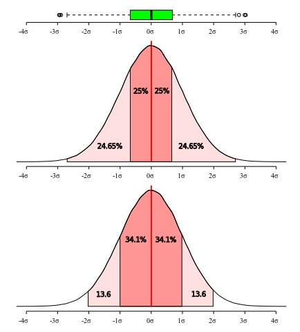
</p>

**Figure 4.** The area under the normal distribution can be defined in units of standard deviation. The central 68% of the distribution is within the mean ± one standard deviation, while 95% of the area is within mean ± one standard deviation. Hence, if we assume a normal distribution we can use the sample mean and standard deviations as estimates of the parameters of the distribution and guess the proportion of individuals expected in a given interval.

All these measures of dispersion give distinct information about the data you are describing and some interpretations requires that some assumptions are met. As will be discussed in more details below, box plots do not make assumptions on the underlying distribution – therefore, it is non-parametric –, whereas standard deviation is more informative under a normal distribution model (or other symetric distributions). As can be seen in Figure 4, the interquartile range is more restrictive than one standard deviation, since the first accounts for 50% of the distribution while the latter 68.2%. If your data is normally distributed, all of those measures will provide a reasonable account of dispersion and adequate description, and the only consideration you have to make is which measure you think is more appropriate to be used for what you desire to describe. However, if your data deviates form a normal distribution, then imposing the model to your data will render an unrealistic description of it and hide information that could be important.


<p align="center">
  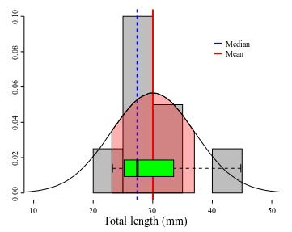
</p>

**Figure 5.** Distribution of total length of Ahamulina catarina depicted by a empirical frequency distribution histogram (in gray), probability density function under normal distribution model with shaded area representing one standard deviation, and the box plot (green).


Back to our example, Marques et al. (2012:55) reported in their original description of Ahamulina catarina that those worms had 23–45 (30±7; 8) mm in length. Applying the concepts we just discussed above, we can infer based on their report that within that sample of 8 worms, the smallest one was 23 mm long, the largest one 45, the average size was 30 mm, and ~68% of that sample had 30±7 mm of length (i.e., between 23 and 37 mm). For these data, the estimates of central tendencies, mean and median, indicate that the distribution has a positive skew (Figure 5). Therefore, suggesting that the normal distribution model is not the best description of the data. Note that the box plot provides a more accurate description of them and could be textually provided by the five-number summary (Tukey, 1977) 23.2, 25.2, 27.4, 33.5, and 44.7, for minimum, 1st quartile, median, 2nd quartile, and maximum. The advantage of this notation is that it does not require assuming that your data is normally distributed and will be more informative when your data is not normally distributed.


### Is normal distribution a required assumption for reporting morphometric data?

<p align="center">
  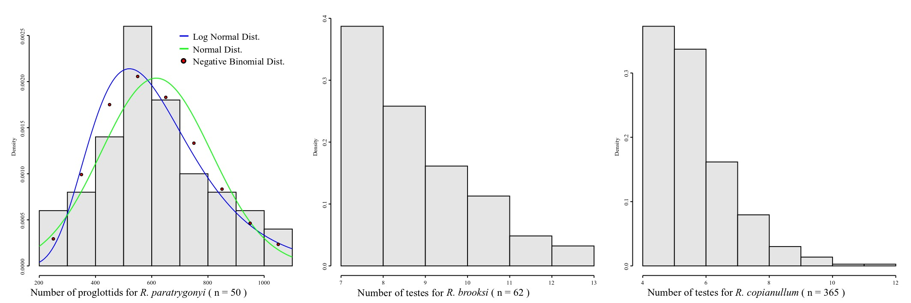
</p>

**Figure 6.** The probability distribution of discrete random variables for three Neotropical freshwater species of Rhinebothrium (raw data from Reyda & Marques, 2011).

Whether you are dealing with discrete or continuous variables defines also the probability distribution you should consider to describe your data. Accordingly, different models of probability distributions exist and are generally classified as discrete probability distributions or as continuous probability distributions. As a rule, if a variable can take on any value between two specified values, it is called a continuous variable as lengths, areas and volumes. Otherwise if a variable is a count it is called a discrete variable. Normal distribution is a continuous distribution. Thus, a priori it should not be assumed for discrete variables – although it is true that in some cases the distribution of some discrete variables may approximate a normal distribution. Be that as it may, in many cases it will not, and one should consider why should we assume a distribution that, from the start, was not intended to provide proper description of our data. Consider the plots in Figure 6.

The distribution of proglottids for Rhinebothrium paratrygonyi, for instance (Figure 6), is better explained by a negative binomial discrete distribution (AIC<sup>[4]</sup> = 672.5385) than two other continuous distributions, normal and log-nomal (AICs = 673.589 and 674.4242, respectively). If you consider the distributions of the number of testes for R. brooksi and R. brooksi it is clear that they cannot be described by a normal distribution.

The justifications for the assumption that morphological continuous characters have normal distribution can be traced to Fisher (1918). He argued that the additive effect of many random environmental variables interact with genotypes producing a range of phenotypes at the same time that phenotypic variation could be associated genetic additive variation at many loci. Under those set of assumptions of random interactions, we should expect a normal distribution for many phenotypic traits (see also Templenton, 2006). Although this may be so, in many instances the approximation to a normal distribution will depend on large sample sizes which is difficult to obtain in our field. For some discrete characters, even large sample sizes will not converge the empirical distribution to a normal model – as is the case for the testes numbers for those 2 species of Rhinebothrium in Figure 6.

Back to the question of this section, we think that normal distribution is not only unnecessary to describe your data but also that in some cases it is not appropriate. In the next section, we provide a tool to compile the five-number summary, which we think that would do a better job as a descriptive statistic parameters for taxonomy.

### Five-number summary

The five-number summary was proposed originally Tukey (1977) as a set of measures for descriptive statistics. The five numbers include the median, the limited is the interquartile ranges and the minimum and maximum values excluding those that are considered outliers, which by his definition are those that exceed the lower and upper limits of the inner fence. The later is arbitrarily defined as 1.5 x IQR (see Figure 4). Although since its conception, the so called “five-number summary” has suffered some modifications and or the inclusion of other metrics (such as mean, for instance), we think that those numbers might do a better job than the standard traditional use of max–min (Mean ± standard deviation). This is particularly true for skewed distribution and also for discrete variables. Finally, the five-number summary, often graphically represented by box plots, make no assumption about the distribution.

With that in mind, we devised the script written in R, which we think that might be a useful tool for you to explore your data. Below we explain how the script works.


Consider that you have compiled the following data:

```
specimen      n_testes
specimen_1	  2
specimen_2	  3
specimen_3	  3
specimen_4	  5
specimen_5	  5
specimen_6	  6
specimen_7	  6
specimen_8	  7
specimen_9	  9
specimen_10	  10
specimen_11	  12
specimen_12	  12
specimen_13	  13
specimen_14	  13
specimen_15	  14
```

If you are familiar with R, you could just execute:

```
>n_testes  <- c(2,3,3,5,5,6,6,7,9,10,12,12,13,13,14)
> summary(n_testes)
```
and you would obtain:

```
Min.  1st Qu.  Median  Mean  3rd Qu.  Max. 
 2      5        7       8     12     14 

```
This summary shows that the minimum valuer for your variable is 2, the maximum is 14, that the distribution is centered in the median 8 and that 50% of your samples have from 5 to 12.

If you are interested in looking at how the box plot for this variable looks like, run:

```
>boxplot(n_testes)
```
and R would return you the following plot:

<p align="center">
  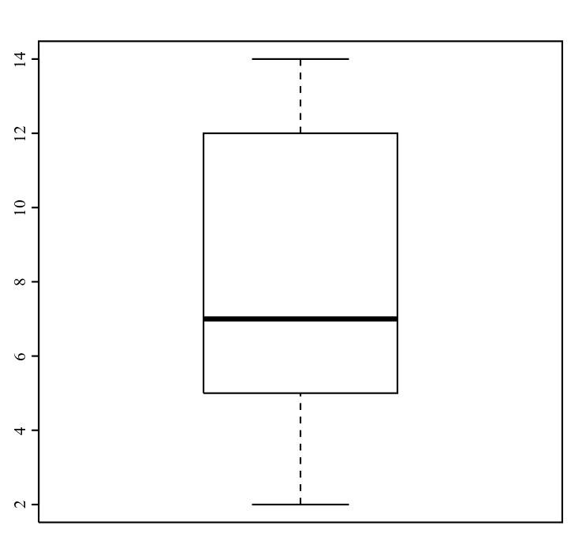
</p>

**Figure 7.** Whisker Plot as a visual representation of the five-number summary statistics.

## How does the compile5numbers.r work?

The script compile5numbers.r was written to plot the distribution of your data as in Figure 7 (wisker plots) either for a set of individuals/population or different sets for comparison purposes. Below I outline the input file format and ways you could analyze your data.

**Structure of the input file**

The input file **must** be a text format file, TAB delimited, and have at least three columns: **specimen**, **group**, and **variable** (as many as desired). It should look like this:

```
specimen        group     n_testes      total_length
specimen_1      host      2             2.1
specimen_2      host      3             2.2
specimen_3      host      3             2.2
specimen_4      host      5             2.3
specimen_5      host      5             2.4
specimen_6      host      6             2.5
specimen_7      host      6             2.6
specimen_8      host      7             1.2
specimen_9      host      9             5.5
specimen_10     host      10            6.7
specimen_11     host      12            6.7
specimen_12     host      12            7.8
specimen_13     host      13            8.0
specimen_14     host      13            8.0
specimen_15     host      14            9.0
```

You can have as many variables you want as well as many groups. Groups are identification tokens for specimens, let us say, host species or localities. One important thing to remember, the script averages out pseudoreplication. Thus, **if the first column has more than a single specimen under the same name within a given group, the script will compute the mean value for the specimen and consider a single data entry** – for the reasons discussed above.

**Modes of execution**

In its simplest form, the script should be executed in a shell terminal with the following sintax:
```
Rscript compile5numbers.r input_file
```
For example, the data above was in a file called example.txt, the execution would be:
```
Rscript compile5numbers.r example
```

This would return the file called **my_out.csv**, which is a file in a CSV (comma separated value) format – therefore you can open it in a spreadsheet application of your choice, with the following content:

|  | stats | n_testes | total_length |
|--|-------|----------|--------------|
| 1 | LowerValue | 2 | 1.2 |
| 2 | 1stQ | 5 | 2.25 |
| 3 | Median | 7 | 2.6 |
| 4 | 3rdQ | 12 | 7.25 |
| 5 | UpperValue | 14 | 9 |
| 6 | N | 15 | 15 |


The problem with this syntax is that you run the risk of overwriting output files, Thus the safest execution syntax would be
```
Rscript compile5numbers.r example -prefix any_word
```
The argument argument “any_word” for the option **-prefix** attaches the term at the beginning of each output file. For example, is you execute
```
Rscript compile5numbers.r example -prefix fernando
```
The same output file as before would be called **fernando_out.csv**.

This script can include as output files boxplots. To do that you have to include the option **-boxplot** into the command line, like:
```
Rscript compile5numbers.r example.txt -boxplot -prefix fernando
```
For the data above, this command line would generate a CSV file (Scalable Vector Graphics) called **fernando_boxplot001.svg** with the following box plots:

<p align="center">
  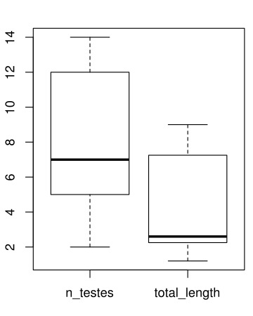
</p>

**Figure 8.** Whisker plots for number of testes and total length in **fernando_boxplot001.svg**.

The last feature of this script is its ability to compute statistics and draw plots comparing groups and variables. To illustrate that, let us modify the input file attributing the specimens to two different hosts. Something like:

```
specimen      group      n_testes      total_length
specimen_1    host_1      2            2.1
specimen_2    host_1      3            2.2
specimen_3    host_1      3            2.2
specimen_4    host_1      5            2.3
specimen_5    host_1      5            2.4
specimen_6    host_1      6            2.5
specimen_7    host_1      6            2.6
specimen_8    host_2      7            1.2
specimen_9    host_2      9            5.5
specimen_10   host_2      10            6.7
specimen_11   host_2      12            6.7
specimen_12   host_2      12            7.8
specimen_13   host_2      13            8.0
specimen_14   host_2      13            8.0
specimen_15   host_2      14            9.0
```

The option that allows you to compare groups per variable is called -groups, obviously! If not evoked, the script will treat the data as a single class group and the results would be the same as before even if your dataset has class groups defined. Here is the an example of command line evoking the comparative analysis:

Rscript compile5numbers.r example_hosts_groups.txt -boxplot -groups -prefix fernando_2
This analysis generates 3 files: fernando_2_out.csv, fernando_2_boxplot001.svg, and fernando_2_boxplot002.svg. The first one contains the summary statistics for each groups, and the other two files are SVG figures containing box plots for each variable.

Here is the structure of the summary statistics:

|  | group | stats | n_testes | total_length |
|--|-------|-------|----------|--------------|
| 1 | host_1 | LowerValue | 2 | 2.1 |
| 2 | host_1 | 1stQ | 3 | 2.2 |
| 3 | host_1 | Median | 5 | 2.3 |
| 4 | host_1 | 3rdQ | 5.5 | 2.45 |
| 5 | host_1 | UpperValue | 6 | 2.6 |
| 6 | host_1 | N | 7 | 7 |
| 7 | host_2 | LowerValue | 7 | 5.5 |
| 8 | host_2 | 1stQ | 9.5 | 6.1 |
| 9 | host_2 | Median | 12 | 7.25 |
| 10 | host_2 | 3rdQ | 13 | 8 |
| 11 | host_2 | UpperValue | 14 | 9 |
| 12 | host_2 | N | 8 | 8 |

Here are the plots generated</sup>[5]</sup>:

<p align="center">
  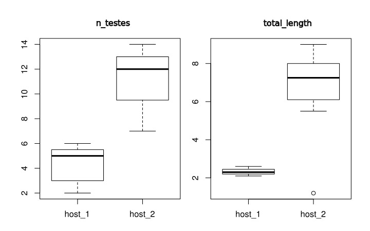
</p>

**Figure 9.** Whisker plots as a visual representation of the five-number summary statistics for two variable and two populations.


The results of this analysis is two plots as shown above. On you left you have the comparative distribution of the number of testes of these two groups of worms. Note that the ranges do not overlap. What does that mean? Well, we would say that the ranges of testes numbers of those specimens do not overlap. That is it. On your right, you have the distribution of the total length of those two groups. There is something worth a comment on that graph. Observe that the box plot recognized an outlier for the specimens attributed to Host 2. This is a useful tool of this script – of the box plot to be fair – that would allow you to recognize in an objective was data points that deviate considerably from the variability of your data. Whether that value a wrong class attribution, measurement error, or even a possible expectation for the distribution (see below) will require you to go back to the specimen, evaluate you data distribution, and think about it.

Before we move to our next section, we want to think a little bit more about the plots above. When you compare the distributions of these two variables, you realize that whereas for number of testes the ranges between specimens from the two hosts are closer to each other than when you compare the distribution reported for total length. The question we want you to ask yourselves is whether you would be willing to use any of those variables to state that specimens from Host 1 differ from those found in Host 2. That is, from what you have at hand, would you be save making generalizations about population parameter estimates? Remember that inferential statistics require large sample sizes and random sampling. How many worms you have? Are they from a single host (per group)? Is your sample biogeographycally representative or are they from a single locality? Did you selected a random sample of the specimens you had, or you selected them based on some criterion that might influence the results of your statistics? Depending of your answer, your analysis ends here, as a description of your data.

### Inferential statistics (some thoughts)

This section deserves a detailed treatment, especially in light of the tools that are available to us to make a better, and perhaps, a proper use of the morphometric data we intent to use in systematics of cestodes. This will come in a later version of this document. For the time being, we would like to pinpoint some to the limitations of the methods described above. We think that the example below will demonstrate to you, what you can and cannot do with descriptive statistics. Consider the following two adjacent normal distribution:

<p align="center">
  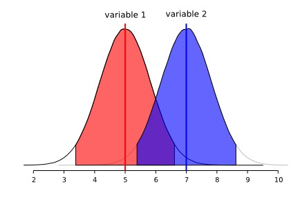
</p>

**Figure 10.** Theoretical normal distributions (saple size = 1000000) for variables 1 (mean=5, sd=0.8) and 2 (mean=7, sd=0.8) with respective shaded areas that correspond to 95% of their distribution.

We will start with two normally distributed variables (1 and 2) that overlap extensively. Observe that each distribution reaches the central tendency of the other. Although we could quantify the area of overlap between these two distributions, suffice to say they overlap more than we would wish for a diagnostic character.

The box plots below are a results of 9 random runs in which we drawn 7 values at random from each distribution and used the values to build the plots. Have a close look at them:

<p align="center">
  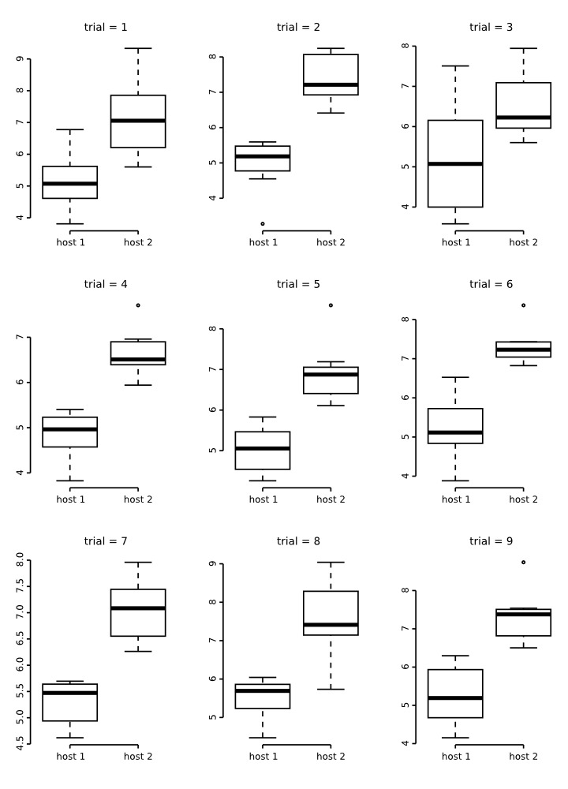
</p>

**Figure 11.** Box plot for 9 trials of sample size = 7 from random samples withdrawn from the distributions in Figure 10.

A close inspections of these box plots reveal that in 2/3 of them the ranges did not overlap despite their original distribution. Also, note that in all of them, the plots are not symmetric, suggesting that the distribution of the data is not normal. All of these attributes are artefacts of a small sample size. Consider that that is the same sample size used for the groups of the plots we generated for testes number and total length above!

Now, look at the behavior of these plots as sample size increases:

<p align="center">
  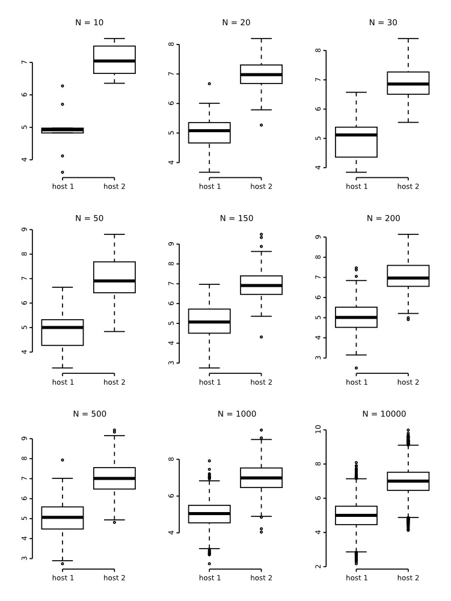
</p>

**Figure 12.**Box plot for 9 trials of sample sizes (N) varying from 10 to 10000 from random samples withdrawn from the distributions in Figure 10.
As can be shown in these box plots above, as the sample sizes increases the more obvious is the overlap between these two distributions. One this to notice as well as that after 200 samples, all plots become symmetric – reflecting the properties of the population distribution, that is, normality. Finally, observe that even withdrawing random numbers from the distribution, the box plots still recognizing some of them as outliers. That illustrate that even if box plots regard some values as outliers they can still be par of your distribution.

## Literature cited

- Fisher, R.A. 1918. The correlation between relatives on the supposition of Mendelian inheritance. Transactions of the Royal Society of Edinburgh 52: 399–433.
- Hurlbert S.H. 1984. Pseudoreplication and the design of ecological field experiments. Ecol Monogr, 54(2):187–211.
- Klazema, A. 2014. Descriptive and Inferential Statistics: How to Analyze Your Data. https://www.udemy.com/blog/descriptive-and-inferential-statistics/ accessed on July, 2014.
- Lane, D.M.; Scott, D.; Hebl, M.; Guerra, R.; Osherson, D and Ziemer, H. 2014. Introduction dto Statistics. Online Statistics Education: A Multimedia Course of Study (http://onlinestatbook.com/). Project Leader: David M. Lane, Rice University. Accessed on July, 2014.
- Lazic, E.S. 2010. The problem of pseudoreplication in neuroscientific studies: is it affecting your analysis? BMC Neuroscience, 11:5.
- Millar, R.B. & Anderson, M.R. 2004). Remedies for pseudoreplication. Fisheries Research, 70(2–3): 397–407.
- Schank J.C. & Koehnle T.J. 2009. Pseudoreplication is a pseudoproblem. Journal of Comparative Psychology, 123(4):421–433.
- Templenton, A.R. 2006. Population genetics and microevolutionay theory. Wiley & Sons, Inc.
- Trochim, W.M.K. 2006. Descriptive Statistics. http://www.socialresearchmethods.net/kb/statdesc.php Accessed on July, 2014.
- Tukey, J.W. 1977. Exploratory Data Analysis. Addison-Wesley.
- Zuur, A.F., Ieno, A.N. & Elphick, C.S. 2010. A protocol for data exploration to avoid common statistical problems. Methods in Ecology and Evolution, 1:3–14.

## Footnotes
- <sup>[1]</sup> See http://en.wikipedia.org/wiki/Log-normal_distribution
- <sup>[2]</sup> Bars are rectangles, then to get their areas multiply their width and height.
- <sup>[3]</sup> For continuous measures the sum is replaced by an integral, which is a limit of a sum.
- <sup>[4]</sup> Akaike information criterion.
- <sup>[5]</sup> You can try yourself downloading the exemple input files provided.

